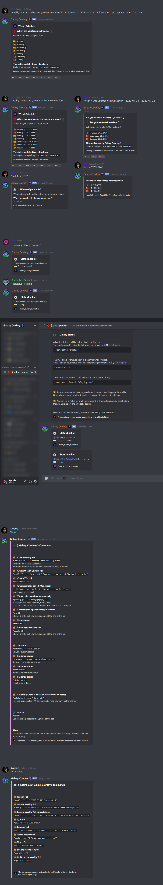

# Galaxy Cowboy

A discord bot to create interactive "When can you meet?" polls easily.




## Use the bot

To use this bot type `*help` to see the commands availables.
You can also use `*examples` to see several examples of how to use the bot.

## Features

- Create RSVP polls up to a week.
- Create timed polls up to a week.
- See the results of a poll as a percentage.
- Only creator can end poll.
- Update command as a call to action.

## Host the bot

To be added.

<!-- To host it create a file name "botconfig.json" or rename and edit "botconfig-sample.json" in the bot's folder. In this file must appear the token of the bot, the prefix ("!poll" by default) and, if wanted, a link to invite.

```json
{
	"token":"your token",
	"prefix":"!poll",
	"link":"the link to invite the bot (optional)"
}
```

Then in a command line in the bot's folder use `npm install`.

Now, to start the bot use `node index.js`. -->

## Galaxy-Cowboy Discord Link

Invite the bot to your server using the link below

<https://discord.com/api/oauth2/authorize?client_id=700457249654571139&permissions=1678113856&scope=bot>

